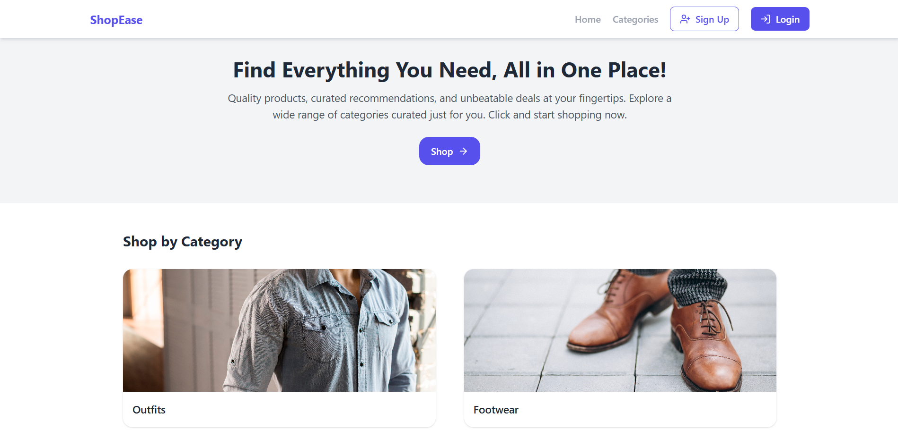
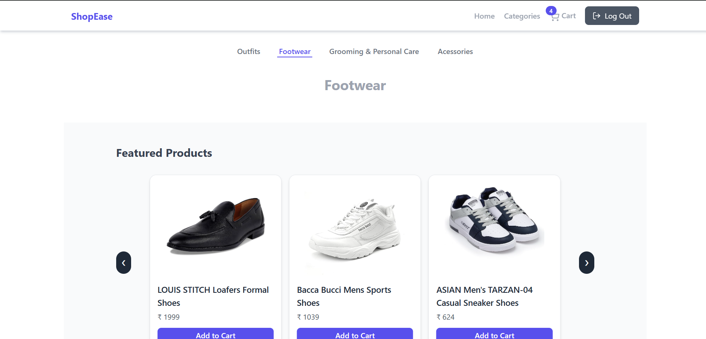
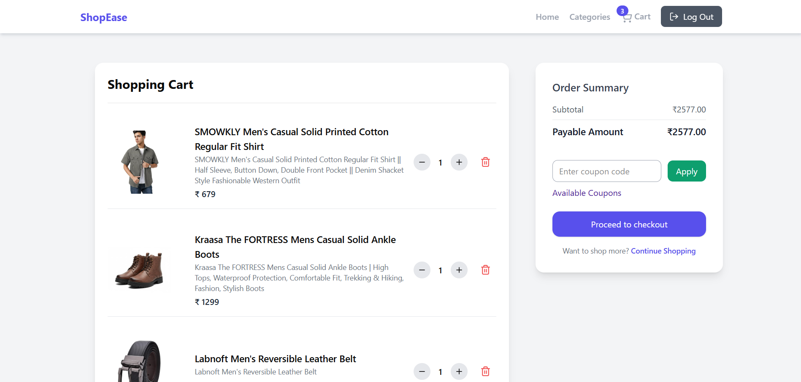
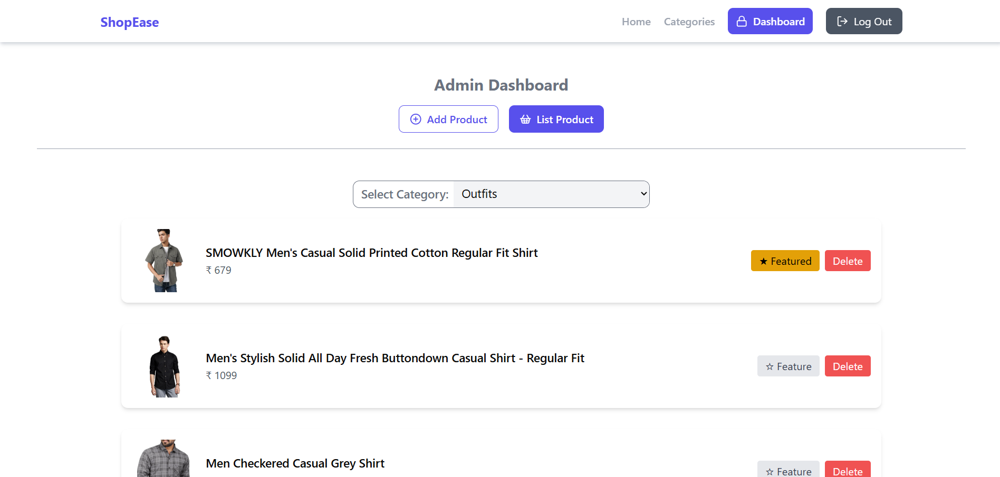

# 🛍️ ShopEase – Full-Stack E-Commerce Platform

ShopEase is a **full-stack MERN e-commerce web application** built to deliver a seamless online shopping experience.  
It provides a **customer storefront** with secure checkout and an **admin dashboard** to manage products and featured listings.

---

## 🚀 Features

### 🧑‍💻 User Features
- **User Authentication & Session Management**
  - Secure **JWT-based login/registration** with access & refresh tokens
  - Persistent sessions with secure logout & token refresh flow
- **Product Browsing**
  - Landing page with **category cards** that redirect to category-specific product pages
  - View all products by category
- **Cart Functionalities**
  - Add products to cart
  - Update product quantity
  - Delete products from cart
- **Checkout**
  - Integrated **Stripe Payment Gateway** for a secure and seamless payment process

### 🛠️ Admin Features
- **Admin Dashboard**
  - Add new products with details and images
  - Delete products
  - Mark products as **featured**
- **Featured Products**
  - Displayed prominently in each category on the frontend

---

## 🏗️ Tech Stack

| Layer         | Technologies Used |
|---------------|--------------------|
| **Frontend**  | [React.js](https://reactjs.org/) • [Tailwind CSS](https://tailwindcss.com/) • [Zustand](https://github.com/pmndrs/zustand) • [Axios](https://axios-http.com/) |
| **Backend**   | [Express.js](https://expressjs.com/) • [MongoDB](https://www.mongodb.com/) • [Mongoose](https://mongoosejs.com/) |
| **Others**    | [Redis](https://redis.io/) for caching • [Cloudinary](https://cloudinary.com/) for image storage • [Stripe](https://stripe.com/) for payments • JSON Web Token (JWT) for authentication |

---

## ⚡ Architecture & Key Highlights
- **MERN Stack**: React frontend + Express backend + MongoDB database.
- **Caching**: Redis used to cache frequently accessed data for better performance.
- **Cloud Storage**: Cloudinary used for efficient image uploads and management.
- **Role-Based Access**: `role` attribute in the User model distinguishes between **admin** and **customer**.
- **Environment-Driven Admin Creation**: The application auto-creates an **admin account** from environment variables if none exists.

---

## 🔑 Environment Variables

Create a `.env` file in the **backend** directory with the following:

```env
PORT=5000
MONGO_URI=your_mongo_connection_string
UPSTASH_REDIS_URL=your_redis_url
UPSTASH_REDIS_TOKEN=your_redis_token
ACCESS_TOKEN_SECRET=your_token_secret
REFRESH_TOKEN_SECRET=your_token_secret
CLOUDINARY_CLOUD_NAME=your_cloud_name
CLOUDINARY_API_KEY=your_api_key
CLOUDINARY_API_SECRET=your_api_secret
STRIPE_SECRET_KEY=your_stripe_secret_key
ADMIN_EMAIL=admin@example.com
ADMIN_PASSWORD=Admin@123
CLIENT_URL=http://localhost:<port-number>
```

---

## ⚙️ Installation & Setup

1️⃣ Clone the Repository
```
git clone https://github.com/ShivamKureel1122/shopease-ecommerce
```

2️⃣ Backend Setup
```
cd backend
npm install
npm run dev
```

3️⃣ Frontend Setup
```
cd frontend
npm install
npm run dev
```

---

## 💻 Usage

Customer
- Register a new account or log in.
- Browse categories and products.
- Add items to your cart and manage quantities.
- Checkout securely using Stripe.

Admin
- Log in with the admin credentials specified in .env.
- Add or delete products from the admin dashboard.
- Mark products as featured to display them on category pages.

---

## 🖼️ Screenshots

### 🏠 Landing Page


### 📍Category Page


### 🛒 Cart Page


### ✅ Admin Page



---

## 🔗 Live Project Link
- https://shopease-ecommerce-store.netlify.app/


---

## 👨‍💻 Author
- [Github](https://github.com/ShivamKureel1122)
- [Linkedin](https://www.linkedin.com/in/shivam-kureel/)
